# Practica 4 Jetkins Alfonso Ballesteros 

## 0º Conceptos
### Que es Jenkins?
Jenkins es una herramienta de automatización usada para implementar procesos de integración y despliegue continuo (CI/CD).

Su función principal es ejecutar automáticamente tareas del desarrollo de software, como instalar dependencias, ejecutar tests, comprobar calidad del código o generar builds cada vez que un desarrollador sube cambios al repositorio. 

### Que tiene que ver Jenkins con GitHub?
Jenkins se integra muy bien con GitHub porque puede conectarse a un repositorio y detectar cambios en ramas o commits; cuando esto ocurre, lanza automáticamente el pipeline definido en el archivo Jenkinsfile. Gracias a esto se implementa una estrategia CI/CD (Continuous Integration / Continuous Delivery), donde el código se valida y construye de forma automática y continua, reduciendo errores y asegurando que la aplicación siempre pueda desplegarse correctamente.

## 1º Instalo Docker para instalar jetkins 
Instalo Docker para instalar jetkins dentro como un contenedor para ahorrar problemas de configuracion de la maquina


## 3. Ejecuto Jenkins en docker com este comando:

´´´

    docker run -d   --name jenkins   -p 8080:8080   -p 50000:50000   -v jenkins_home:/var/jenkins_home   jenkins/jenkins:lts

´´´


-p 8080:8080 y  -p 50000:50000  Ppra los puertos
-v jenkins_home:/var/jenkins_home   jenkins/jenkins:lts

para que mi directorio jetkins este unido con el suyo

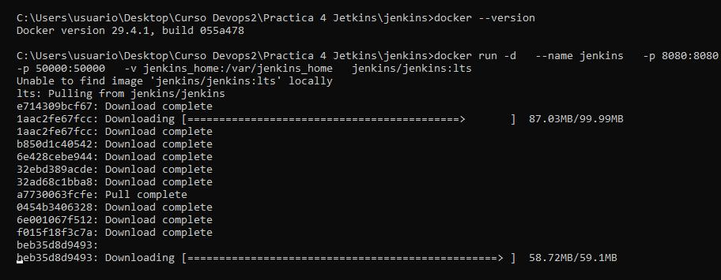


Compruebo que esta corriendo bien 

´´´

    docker ps 

´´´

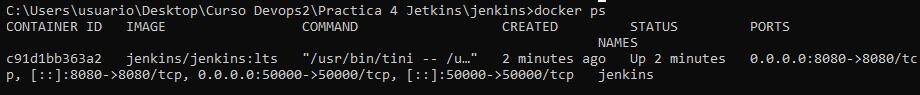


## 3. Nos vamos al localhost de jetkins 

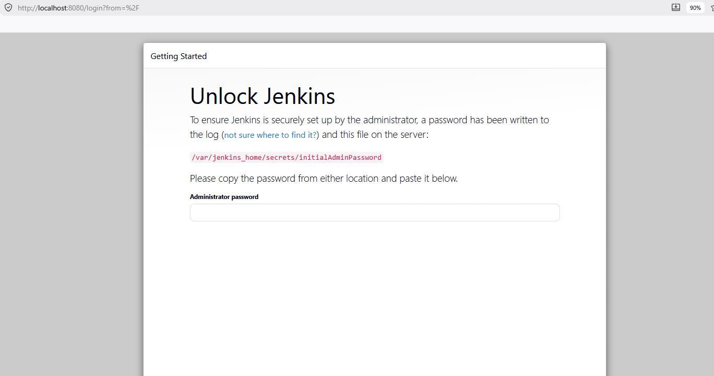

Nos falta esa password y la buscamos con 

## 4. Obtener contraseña inicial

Ejecuto 

´´´bash 
        docker logs jenkins
´´´

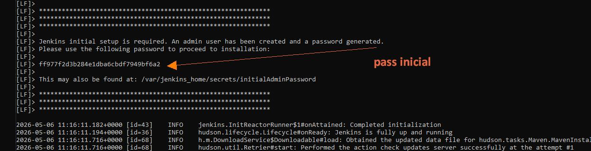


## 5. Instalamos jetkinsa
la copiamos en localhost para proceder a la instalación

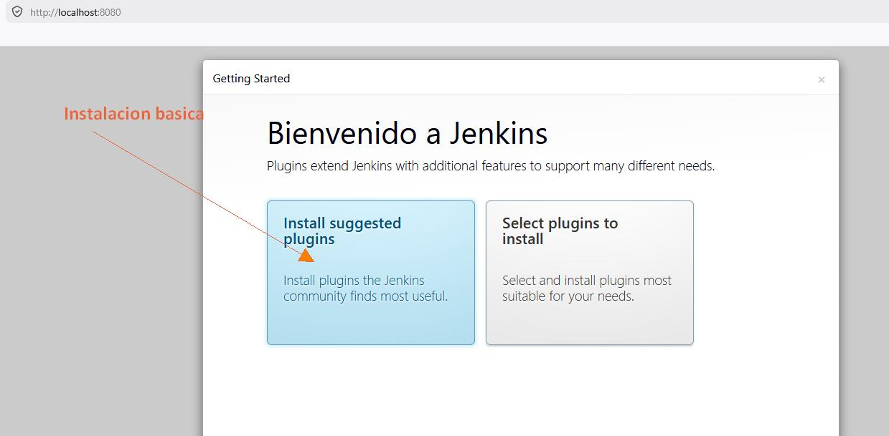


## 6. Creamos usuario

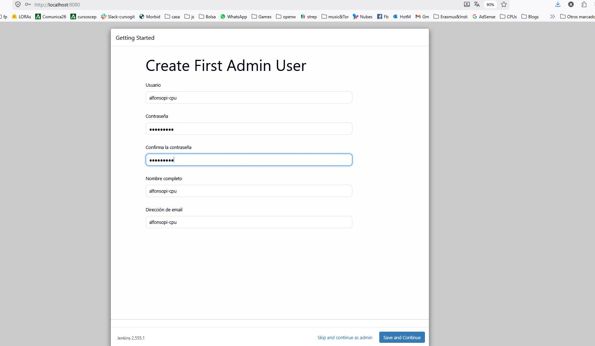

Genial ya tenemos la configuracion en los volumenes 

-v jenkins_home:/var/jenkins_home   jenkins/jenkins:lts

pero esa no nos sirve ya que le falta node 


## 7 Creo una imagen con node para que pueda funcionar el proyecto


Pero la imagen de jetkins que tenemos no tiene node asi que vamos a crear una nueva con el asi que paramos la maquina y la borramos pero dejamos la imagen que vamos a usar de base y el volumen 

```
    docker stop jenkins

    docker rm jenkins

```

Como nuestro proyecto ya tiene un dockerfile montado pues vamos adelante 

```Dockerfile
FROM jenkins/jenkins:lts-jdk21

USER root

# Install docker-cli
RUN apt-get update && apt-get install -y lsb-release zip \
  && curl -fsSLo /etc/apt/keyrings/docker-archive-keyring.asc https://download.docker.com/linux/debian/gpg \
  && echo "deb [arch=$(dpkg --print-architecture) signed-by=/etc/apt/keyrings/docker-archive-keyring.asc] https://download.docker.com/linux/debian $(lsb_release -cs) stable" > /etc/apt/sources.list.d/docker.list \
  && apt-get update && apt-get install -y docker-ce-cli

# Install docker-compose
RUN curl -fsL https://api.github.com/repos/docker/compose/releases/latest | grep tag_name | cut -d '"' -f 4 | tee /tmp/compose-version  \
  && mkdir -p /usr/lib/docker/cli-plugins  \
  && curl -fsSLo /usr/lib/docker/cli-plugins/docker-compose https://github.com/docker/compose/releases/download/$(cat /tmp/compose-version)/docker-compose-$(uname -s)-$(uname -m)  \
  && chmod +x /usr/lib/docker/cli-plugins/docker-compose  \
  && ln -s /usr/lib/docker/cli-plugins/docker-compose /usr/bin/docker-compose  \
  && rm /tmp/compose-version

# Install NodeJS
RUN apt-get update \
  && apt-get install -y ca-certificates curl gnupg \
  && curl -fsSL https://deb.nodesource.com/setup_lts.x | bash -  \
  && apt-get install -y nodejs

USER jenkins
```

Vamos a crear la imagen de jetkins + node y la llamamos jenkins-node

```
    docker build -t jenkins-node .
```
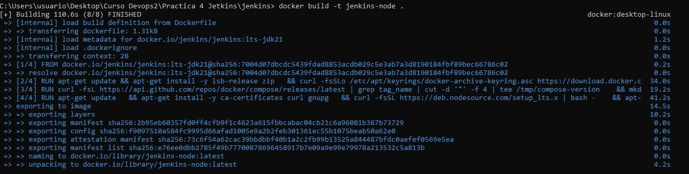

## 8 Ejecutamos jetkins con node dentro 

```
    docker run -d   --name jenkins   -p 8080:8080   -p 50000:50000   -v jenkins_home:/var/jenkins_home   jenkins-node
  
```
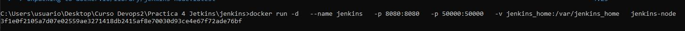

y nos logeamos en localhost

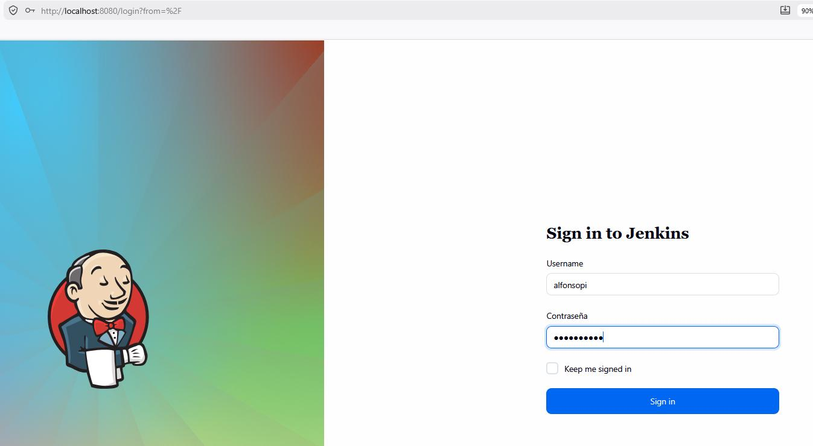


## 9 configurar Jetkins+github
Ya tenemos el jetkins instalado en local vamos a configurar el proyecto.

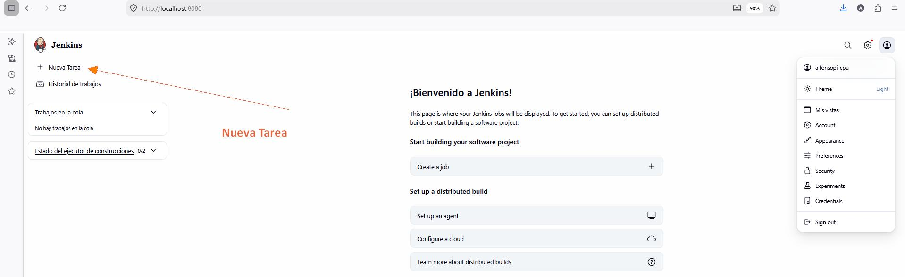


## 10 Escogemos una multibranch
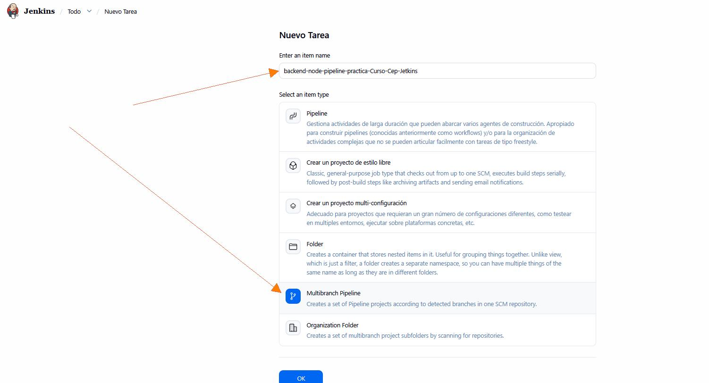


## 11 En sources ponemos nuestro github

 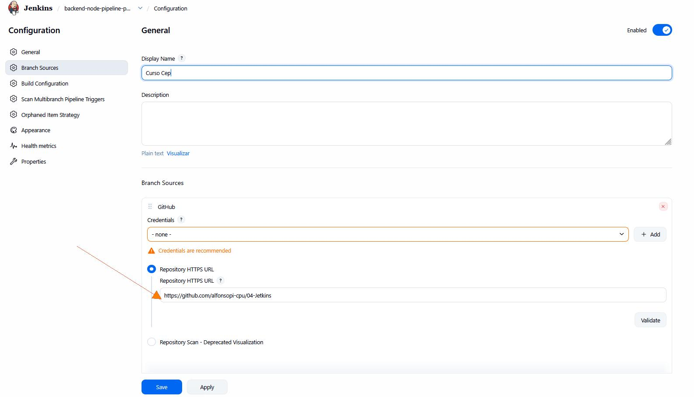

 ## 12 Guardamos y se pone a scanear nuestro github

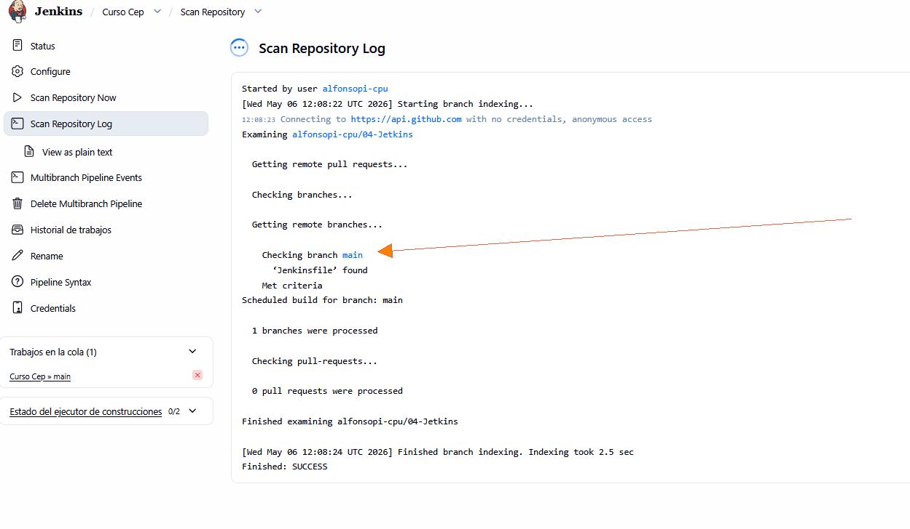

Aqui debe haber encontrado nuestra rama main 


 ## 13 Selecionando el Job
Nos vamos al panel central de jetkins y deberia salir algo asi 
Pulsamos en el job (A mi me sale Curso cep pq es el nombre que le puse antes)

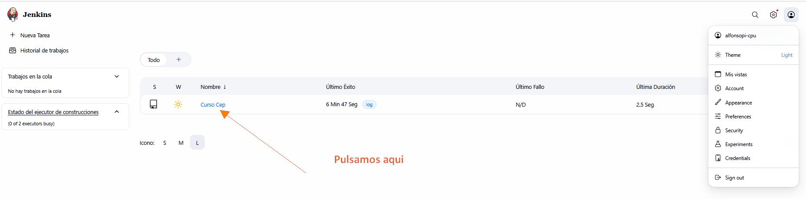

 ## 13 Haciendo el build 

ya pulsamos en build o construir 
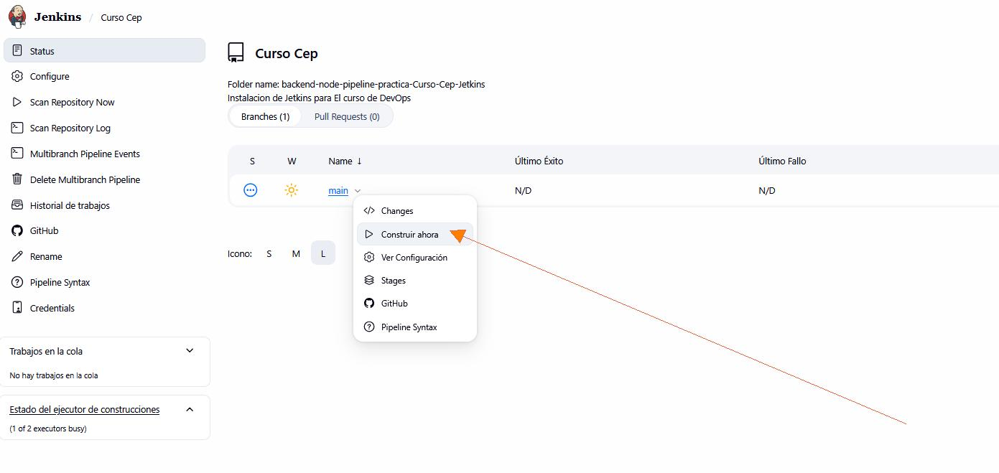


 ## 14 Haciendo el build 

Podemos comprobar que todo ha ido bien en status que deberia salir algo asi y en el fichero server.mjs

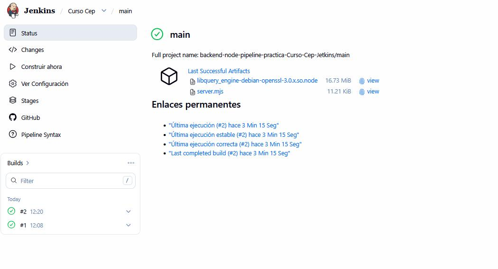


 ## 15 Resumen 
El flujo funciona así cuando subos código a GitHub y Jenkins revisa automáticamente el repositorio buscando cambios. Cuando detecta una nueva versión del código (por ejemplo un commit en la rama main), ejecuta el Jenkinsfile, que contiene una serie de pasos automáticos llamados pipeline. En ese pipeline Jenkins comprueba que el proyecto funciona correctamente: instala dependencias, verifica el formato del código, analiza calidad, revisa tipos, ejecuta tests y finalmente genera la build de la aplicación. Si todo sale bien, guarda los artefactos generados (dist/server.mjs) y muestra un mensaje de éxito; si algo falla, detiene el proceso y muestra errores en los logs. 


## 15 Probamos que esta bien instalado
### Hago unos cambios 

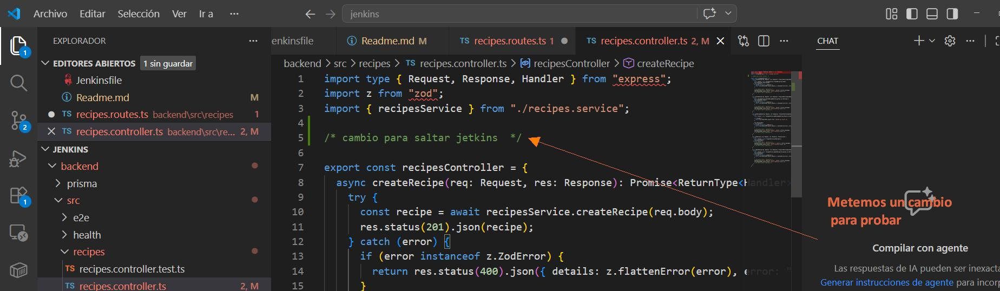

### Hago  commit y push con los cambios 

```

git add .
git commit -m "Test Jenkins pipeline"
git push

```
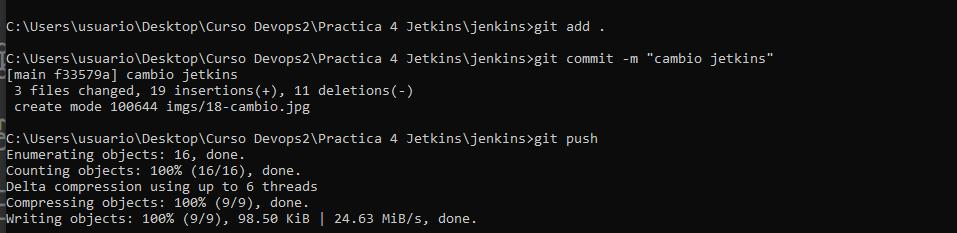

### Solicito un Scan Multibranch Pipeline Now

Voy a Jenkins → tu proyecto → rama main.
Pulsa: Scan Multibranch Pipeline Now

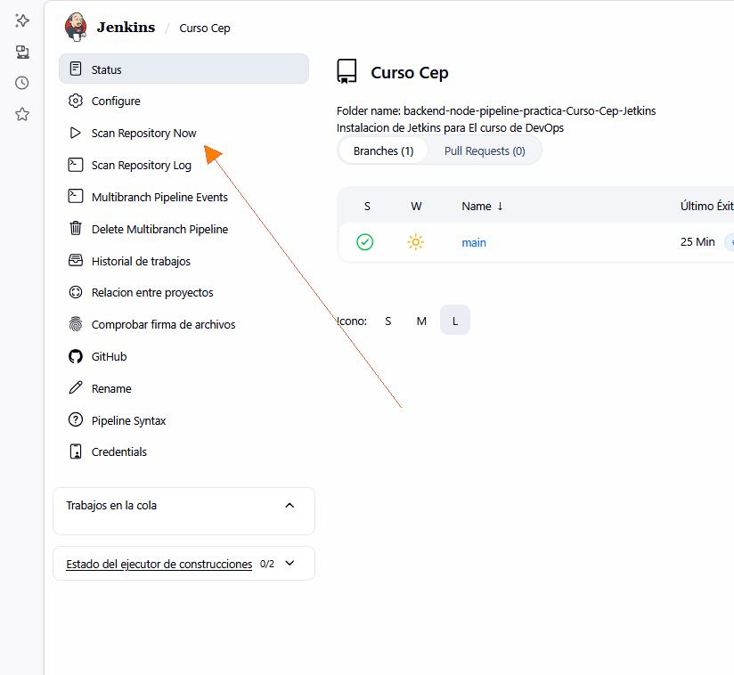

## 16 Comprobamos Console output

Pulso en  Console output de la ultima ejecucion 

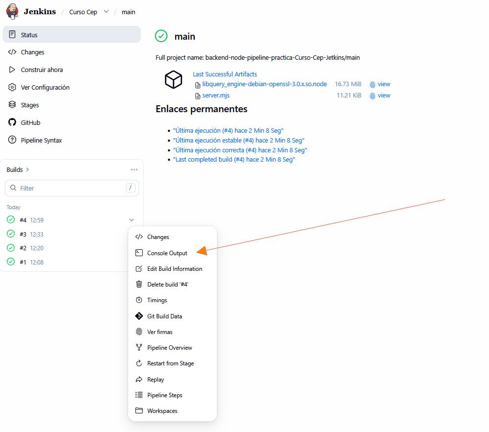

Compruebo que todo va bien

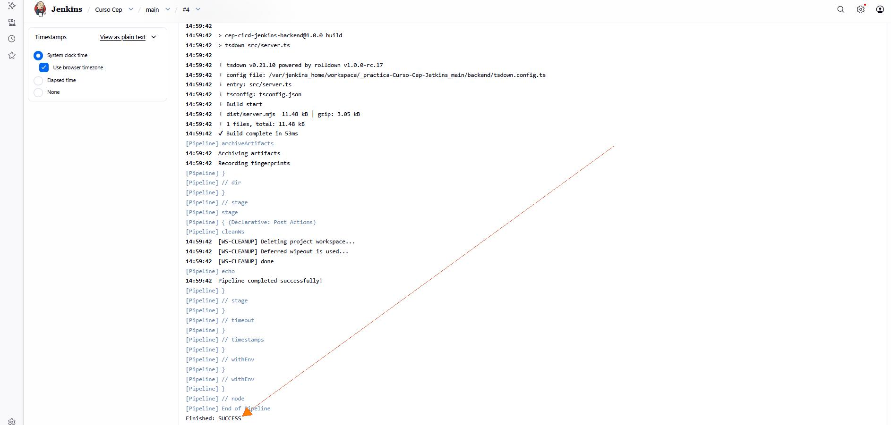


